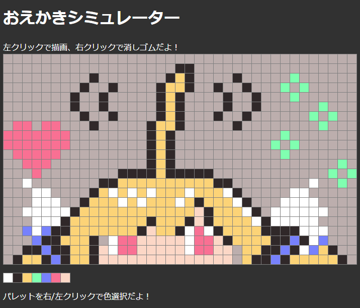
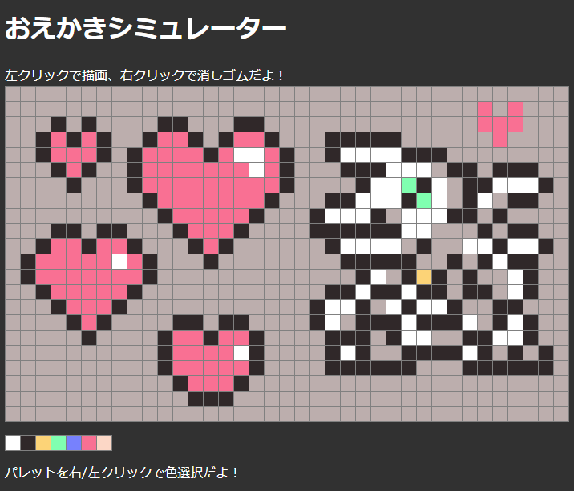

# アズールレーンおえかきシミュレーター

  

  

## なんぞこれ？

アズールレーンのおえかき機能を、いつでも自由に使いたい！  

という人のためのおえかきシミュレーターです。  

現在、期間限定イベント「一周年記念イベント・上」のカラーパレットにのみ対応しています。  

## どう使うの？

index.htmlをブラウザで開いてください。  

html + JavaScript + cssのみで、外部との通信等はしておりません。  

キャンバスを左クリックすると色を塗ることができます。  

キャンバスを右クリックするとデフォルトの背景色に戻ります。  

色選択には、キャンバス下のカラーパレットをクリックしてください。  

保存/復元機能等はありません。ブラウザをリロードすると消えます。ご了承ください。  
